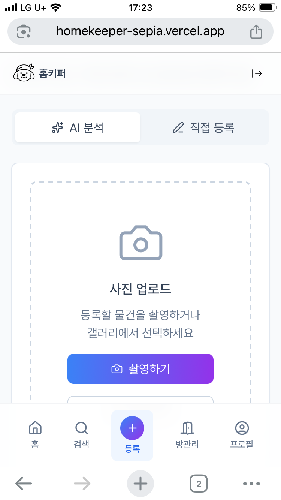
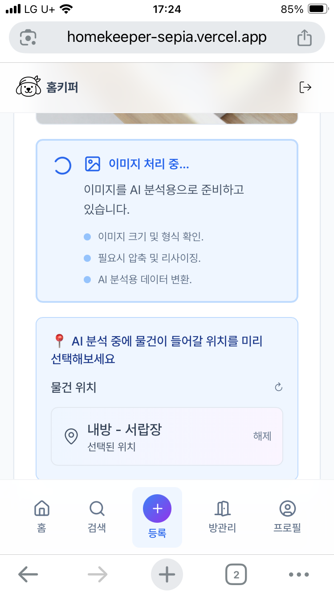
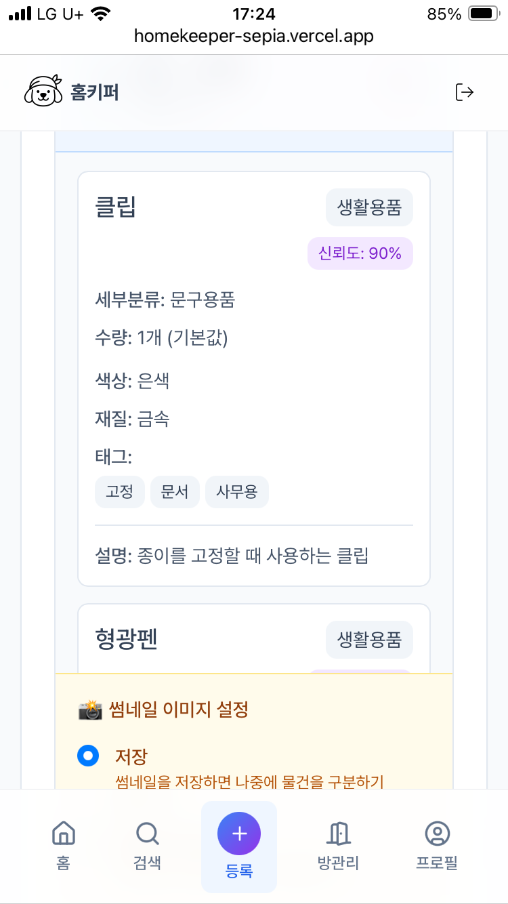
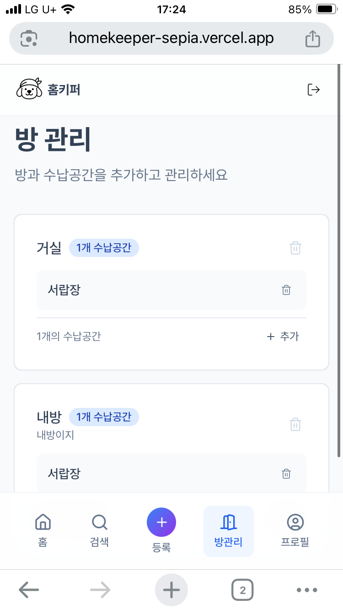
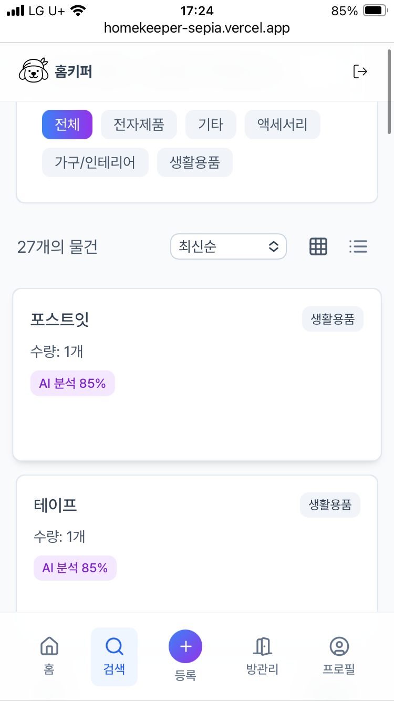
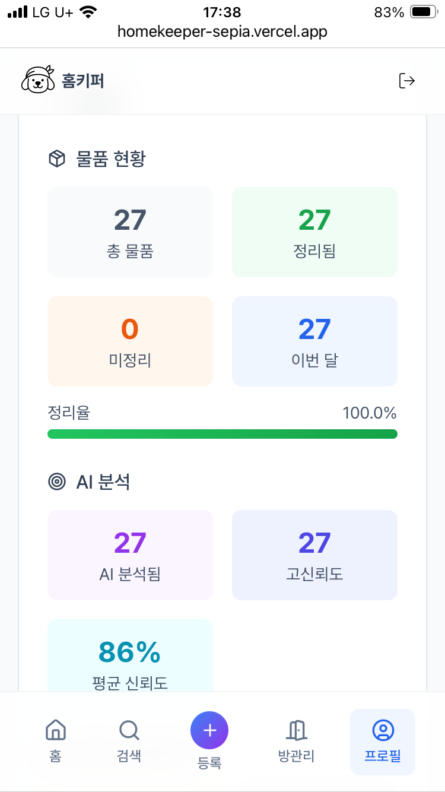
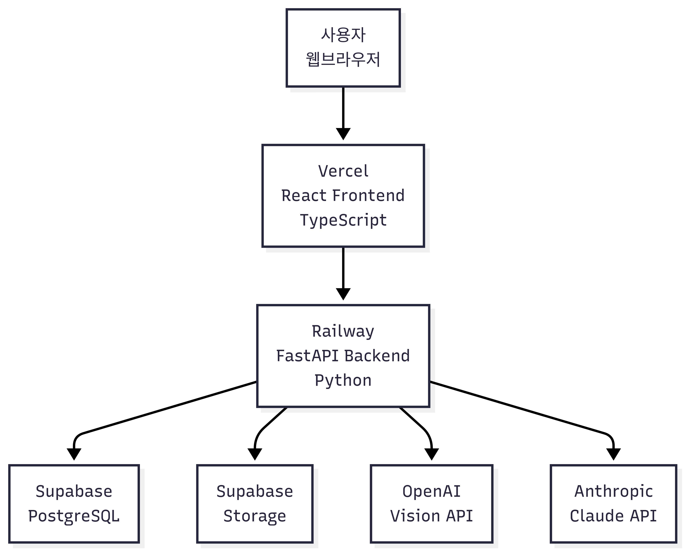
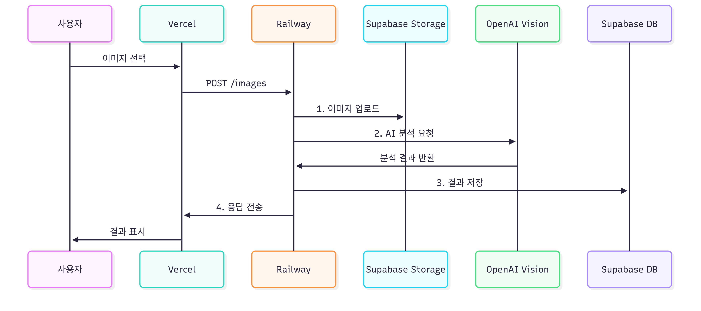
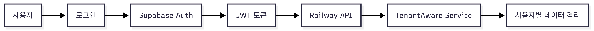
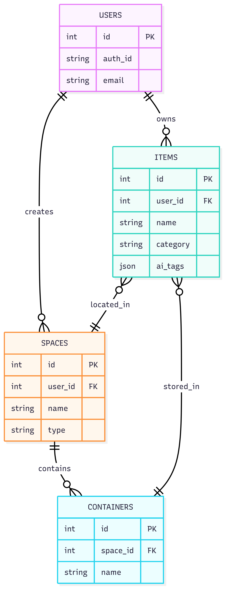

#  홈키퍼: AI 기반 집안 물건 관리 시스템

> **AI 이미지 분석**을 활용해 집안 물건을 자동으로 분류하고 관리하는 **풀스택 웹 애플리케이션**

**[라이브 데모 체험](https://homekeeper-sepia.vercel.app/)** | **[API 문서](https://homekeeper-api-production.up.railway.app/docs)**

---

## 프로젝트 개요

**문제 정의**: 개인이 집안 물건을 찾느라 시간을 낭비하고, 이미 있는 물건을 중복 구매하는 일이 빈번함

**해결책**: 사진 한 장 업로드 → AI가 자동으로 물건을 인식하고 분류해서 개인별로 체계적으로 관리

**핵심 가치**: AI 기술을 활용한 개인 사용자 중심의 실용적인 문제 해결과 사용자 경험 개선

**설계 원칙**: 개인 사용자 중심의 독립적 데이터 관리 구조로, 각 사용자가 자신의 데이터만 접근하고 관리

### 주요 기능

- **AI 이미지 분석**: OpenAI GPT-4o-mini로 사진 속 물건을 자동 인식하고 카테고리/태그를 생성
- **위치별 관리**: 개인 사용자의 방과 서랍 정보로 물건 위치 체계적 관리
- **데이터 보안**: 사용자 인증을 통한 데이터 격리 및 개인정보 보호
- **신뢰도 기반 분류**: AI 분석 결과의 신뢰도 점수를 표시하고 사용자가 직접 수정 가능

---

## 데모 영상

<video width="100%" controls>
  <source src="assets/demo.mp4" type="video/mp4">
  브라우저가 비디오 태그를 지원하지 않습니다. <a href="assets/demo.mp4">여기</a>를 클릭하여 다운로드하세요.
</video>

**직접 다운로드:** [demo.mp4](assets/demo.mp4)

**스크린샷**

<table>
  <tbody>
    <tr>
      <th align="center">사진 업로드</th>
      <th align="center">이미지 분석</th>
    </tr>
    <tr>
      <td align="center">
        
      </td>
      <td align="center">
        
      </td>
    </tr>
    <tr>
      <th align="center">이미지 분석결과</th>
      <th align="center">방 관리</th>
    </tr>
    <tr>
      <td align="center">
        
      </td>
      <td align="center">
        
      </td>
    </tr>
     <tr>
      <th align="center">물건 관리</th>
      <th align="center">통계</th>
    </tr>
    <tr>
      <td align="center">
        
      </td>
      <td align="center">
        
      </td>
    </tr>
  </tbody>
</table>

---

## 시스템 아키텍처

- **계층형 구조**: Models → Repositories → Services → Routers로 관심사 분리
- **개인 데이터 격리**: 사용자별로 독립된 데이터 관리 시스템
- **RESTful API**: FastAPI 기반 자동 문서화 및 타입 안전성 보장
- **타입 동기화**: 백엔드 스키마 기반 TypeScript 타입 생성

 

**홈키퍼 시스템 아키텍처**

  

**이미지 분석 플로우**

  

**인증 플로우**

  

**주요 테이블 관계**

  

### 기술 스택

**프론트엔드**

- Vite + React + TypeScript
- Tailwind CSS + React Query
- Playwright (E2E 테스트)

**백엔드**

- FastAPI + Python 3.12+
- SQLModel (Pydantic + SQLAlchemy)
- PostgreSQL 데이터베이스

**AI & 클라우드**

- OpenAI GPT-4o-mini
- Supabase (인증 + 스토리지)
- Railway (백엔드) + Vercel (프론트엔드)

---

## 핵심 기술 구현

### AI 이미지 분석 시스템

- **이중 AI 제공자**: OpenAI GPT-4o-mini 우선, 실패 시 Anthropic Claude로 자동 폴백
- **이미지 전처리**: AI 분석 전 1024x1024 리사이징 및 JPEG 85% 품질 압축
- **구조화된 프롬프트**: 일관된 JSON 응답을 위한 상세 프롬프트 템플릿 설계
- **응답 파싱**: Pydantic 모델을 통한 AI 응답 구조화 및 검증
- **모듈화 설계**: AI 서비스와 이미지 처리 서비스 분리로 유지보수성 확보
- **사용자 데이터 격리**: 인증된 사용자만 자신의 데이터에 접근 가능하도록 격리

### 프롬프트 엔지니어링

- **표준 카테고리 체계**: 10개 주요 카테고리, 67개 세부 분류 정의
- **다중 아이템 감지**: 한 이미지 내 여러 물건 개별 인식 및 분석
- **한국어 최적화**: 한국 가정환경에 특화된 물건 분류 및 명명
- **신뢰도 측정**: 0.0-1.0 스케일 신뢰도 점수 및 임계값 관리

### 현재 구현 상태

- **구현 완료**: AI 이미지 분석, 사용자 인증, 물건/공간/컨테이너 관리
- **부분 구현**: 카테고리 관리 (라우터는 존재하지만 모델과 비즈니스 로직 미완성)
- **미구현**: 벡터 검색, 고급 통계 분석, 알림 시스템

---

## 주요 성과

### 기술적 성취

- **실제 사용자 서비스 런칭**: 실제 사용자가 사용할 수 있는 서비스 출시
- **AI 통합**: OpenAI GPT-4o-mini 통합 및 프롬프트 엔지니어링 경험
- **엔드투엔드 시스템 개발**: 사용자 인터페이스부터 서버 로직까지 전체 흐름 구현
- **보안 시스템**: 사용자 인증 및 데이터 격리를 통한 개인정보 보호
- **멀티 클라우드 인프라 구축**: Railway, Vercel, Supabase 등 여러 클라우드 서비스 활용

### AI 활용 개발 경험

- **AI 코딩 도구 활용**: AI 코딩 어시스턴트를 활용한 개발 생산성 향상 경험
- **자유로운 실험 환경**: 사이드프로젝트에서 AI 도구 활용을 자유롭게 실험하고 실패를 통해 학습
- **AI 기술 학습 기반 구축**: 향후 고급 AI 기술 학습을 위한 기반 시스템 구축. (AI 기술 학습을 위해 Python 백엔드 선택)

---

## 향후 계획

### 사용성 개선

- **AI 분석 속도 개선**: 비동기 처리 및 사용자 경험 최적화
- **여러 이미지 등록**: 여러 장의 사진을 한 번에 업로드하여 일괄 처리
- **옷장 정리 전용 모드**: 옷장 정리에 특화된 등록 및 관리 워크플로우
- **사용자 피드백 학습**: 사용자가 수정한 분류 결과를 학습하여 향후 분석 정확도 향상
- **모바일 앱 개발**: 웹보다 사용하기 편한 모바일 앱으로 서비스 확장

### 고급 기능

- **RAG 기반 물건 관리 가이드**: 물건의 특성과 용도에 따른 보관법, 정리 팁, 최적 보관 위치 제안
- **정리 습관 분석**: 사용자의 물건 등록 패턴을 분석하여 정리 효율성 개선 방안 제시
- **재고 관리 시스템**: 물건의 보유 현황을 체계적으로 관리하여 중복 구매 방지
- **재활용 가이드**: 물건의 재활용 가능성과 방법을 AI가 분석하여 제안
- **분리수거 안내**: 물건의 재질과 분리수거 방법을 자동으로 안내

### 기술적 개선

- **카테고리 시스템 완성**: 현재 미완성인 카테고리 관리 모델 및 비즈니스 로직 구현
- **벡터 검색**: Qdrant 설정은 완료되었으나 실제 구현은 미완성
- **성능 최적화**: 데이터베이스 쿼리 최적화 및 캐싱 시스템 도입

---

## 프로젝트 링크

- **실제 서비스**: https://homekeeper-sepia.vercel.app/
- **API 문서**: https://homekeeper-api-production.up.railway.app/docs/
- **기술 블로그**: https://skyparci.vercel.app/

---

## 기술적 인사이트

**다시 한다면 이렇게**

- **보안 우선 설계**: 민감 정보 Git 히스토리 보호 및 LLM 사용 시 .env 파일 접근 금지 등 보안 규칙 명시적 수립
- **환경 격리 우선**: 프로젝트 시작과 동시에 로컬/테스트/프로덕션 분리하여 나중의 대규모 리팩토링과 데이터 오염 사고 방지
- **기술 부채 최소화**: 새 기능 2개 추가할 때마다 1회씩 LLM 코드 재검토 및 최적화 시간 확보
- **모델 설계 우선**: 데이터 모델과 API 설계를 먼저 완성한 후 구현 단계로 진행
